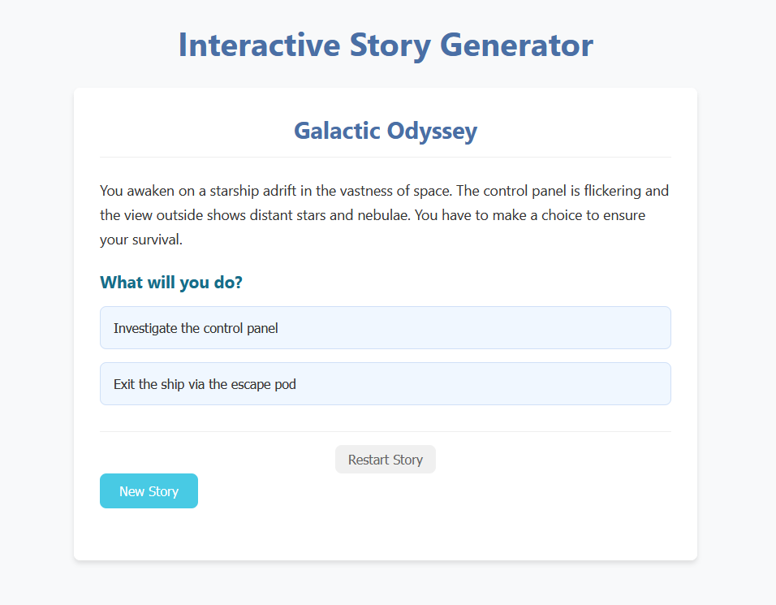

# Interactive Story Generator

This project demonstrates an interactive story generator built using FastAPI and OpenAI's API. 
We can generate a story based on a theme, and play through the generated options to reach the ending of the story.

## Features
- Interactive story generation
- Integration with OpenAI's API
- Options leading to multiple endings.
- FastAPI backend server.
- Simple and clear interface.